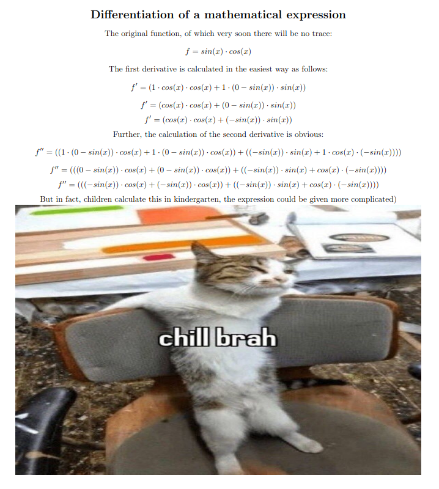

# Symbolic Differentiator

A symbolic differentiator that calculates the analytical derivatives of mathematical functions specified in a string.

## Features

**Core Operations**: `+`, `-`, `*`, `/`, `^` 
**Elementary Functions**: `sin`, `cos`, `ln`, `tan`, etc.  
**Higher-Order Derivatives**: Calculation of 1st and 2nd order derivatives
**Optional Simplification**: Reduce expressions (e.g., `x*1 → x`)  

## Installation

```bash
git clone https://github.com/lavrt/Differentiator
cd Differentiator
make run
```

## Quick Start
- Open the file `expression.txt`
- Write in it the expression that needs to be differentiated without using spaces. Put the terminal character `$` at the end of the expression and save the file
- Run the program with the `make run` command. You can see the result of the program in the `derivative.tex` file

## How It Works
- Parsing: converts input strings into ASTs using grammar rules.
- Recursive differentiation: applies differentiation rules (power rule, chain rule, and others).
- Simplification: optional algebraic simplification of results.

## Program operation
#### Input: 
```
sin(x)*cos(x)$
```
#### Output:
